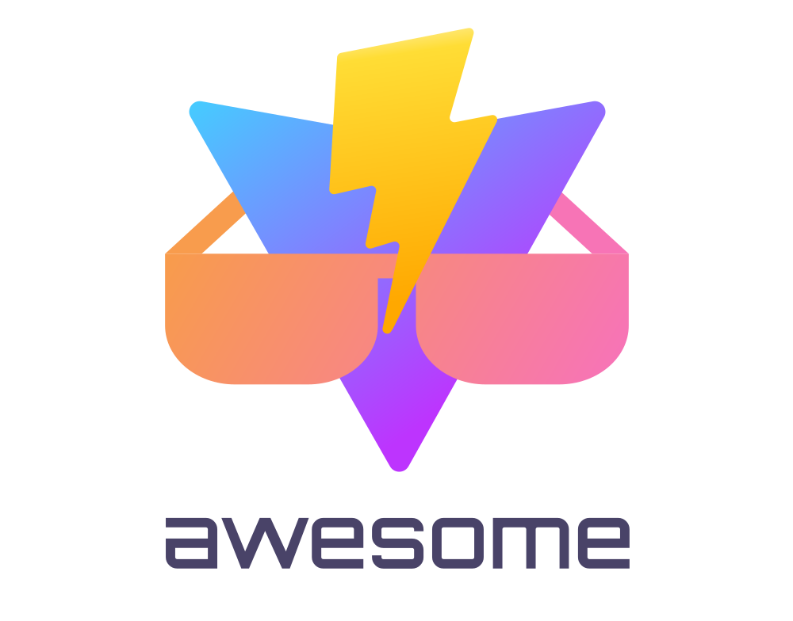

   
  
   
   

<h2 align='center'>Awesome Vite.js</h2>

收集一些关于 <a href='https://github.com/vitejs/vite'>Vite.js</a>的一些资源
  

## 资源

### 官方资源

- [vite 文档](https://cn.vitejs.dev/)
- [GitHub Repo](https://github.com/vitejs/vite)
- [发版说明](https://github.com/vitejs/vite/blob/main/packages/vite/CHANGELOG.md)
- [Vue3 文档](https://v3.cn.vuejs.org/)
- [Vue 资源](https://github.com/vuejs/awesome-vue)

## 开始

- [@vite/create-app](https://cn.vitejs.dev/guide/#scaffolding-your-first-vite-project) - 搭建你第一个 vite 项目.

### 模板

#### Vue 3

- [Vitesse](https://github.com/antfu/vitesse) - 入门模板.
- [vite-vue3-tailwind-starter](https://github.com/web2033/vite-vue3-tailwind-starter) - Vue 3, Vue Router 和 Tailwind CSS 示例.
- [vite-ts-tailwind-starter](https://github.com/Uninen/vite-ts-tailwind-starter) - TypeScript, Tailwind CSS, Cypress.io e2e tests + CI.
- [vite-electron-quick](https://github.com/MangoTsing/vite-electron-quick) - Vue 3, TypeScript ,Electron 11 的客户端开发模板.
- [vite-electron-builder](https://github.com/cawa-93/vite-electron-builder/) - Electron apps 使用 Vite 作为前后端, 以及自动发布.
- [vue-vben-admin](https://github.com/anncwb/vue-vben-admin) - 基于 Vue3、Ant-Design-Vue、TypeScript 的后台管理模板.
- [electron-vue-next](https://github.com/ci010/electron-vue-next) - Vue 3 和 Electron 与 VS Code 调试和 GitHub 发布过程开箱即用.
- [vite-wind](https://github.com/boussadjra/vite-wind) - 带有 Tailwind CSS、TypeScript、css-pro-layout、9+ 组件和 dark mode 支持的模板。.
- [vite-electron-ts](https://github.com/cyytemplate/vite-electron-ts) - Electron 12, Vue 3 以及 TypeScript.
- [d2-advance](https://github.com/d2-projects/d2-advance) - 带有 Tailwind CSS、TypeScript 的模板.
- [vue-pure-admin](https://github.com/xiaoxian521/vue-pure-admin) - 基于 Vue3、TypeScript、Tailwind CSS、element-plus 的后台管理模板.
- [vite-electron-typescript-template](https://github.com/hocili/vite-electron-typescript-template/) - Electron 12 TypeScript 模板.
- [vite-ts-quick](https://github.com/pohunchn/vite-ts-quick) - Vue 3 + Vuex + Vue-router + TypeScript 快速模板.
- [fast-crud](https://github.com/fast-crud/fast-crud) - 快速 crud 模板.
- [vivu](https://github.com/logustra/vivu) - 一个高度自定义且使用 vite 的模板.
- [electron-vite-quick-start](https://github.com/yingpengsha/electron-vite-quick-start) - 全栈使用 Vite 运行 Electron 应用程序，包括主进程.

#### Vue 2

- [vite-vue2-windicss-starter](https://github.com/lstoeferle/vite-vue2-windicss-starter) - Vue 2, Vue Router, Composition API, VueUse, Windi CSS 以及 TypeScript 的模板.
- [vite-vue2-starter](https://github.com/matt-auckland/vite-vue2-starter) - Barebones Vue 2 starter，类似于 Vue-Cli 的基础模板.
- [admin-base-tmpl](https://github.com/artskin/admin-base-tmpl) - 使用 Vue2、TypeScript、Element UI 的基本管理模板.

#### React

- [vite-reactts-electron-starter](https://github.com/lTimeless/vite-reactts-electron-starter) - React, TailwindCSS, TypeScript 以及 Electron.
- [vite-reactts-chakra-starter](https://github.com/Dieman89/vite-reactts-chakra-starter) - React, Typescript, Chakra, Cypress.
- [electron-vite-react](https://github.com/twstyled/electron-vite-react) - Electron, TypeScript and Tailwind CSS with [twstyled](https://github.com/twstyled/twstyled).
- [vite-electron-esbuild-stater](https://github.com/jctaoo/vite-electron-esbuild-starter) - 使用 React, Typescript, Electron 以及 esbuild 的快速开发模板.
- [Vitamin](https://github.com/wtchnm/Vitamin) - React Typescript, TailwindCSS, SPA + PWA, Cypress and CI.
- [vite-react-tailwind-rtk](https://github.com/jamosaur/vite-react-tailwind-rtk) - React, Tailwind, Redux Toolkit.
- [vite-reactts-eslint-prettier](https://github.com/TheSwordBreaker/vite-reactts-eslint-prettier) - React, TypeScript, ESlint, Prettier, Pre-commit.
- [vite-reactts-antd-starter](https://github.com/asurraa/react-vite2-ts-antd) - React, Typescript, Antd.
- [react-vite-admin](https://github.com/ychengcloud/react-vite-admin) - React, Recoil, React Query, React Hooks, TypeScript, Axios.
- [vite-template-react](https://github.com/SafdarJamal/vite-template-react) - 一个快速创建 React App-like 的模板.
- [vitejs-template-react-rescript](https://github.com/jihchi/vitejs-template-react-rescript) - [Vite official React template](https://github.com/vitejs/vite/tree/main/packages/create-app/template-react) + ReScript.

#### Svelte

- [sttv](https://github.com/srmullen/sttv) - Svelte, TailwindCSS, TypeScript.
- [svelte-vite-ssr](https://github.com/jiangfengming/svelte-vite-ssr) - Svelte with SSR support.

## 插件

### 与框架无关的插件

#### Integrations

- [vite-plugin-pwa](https://github.com/antfu/vite-plugin-pwa) - 零配置 PWA.
- [vite-plugin-purge-icons](https://github.com/antfu/purge-icons/tree/main/packages/vite-plugin-purge-icons) - PurgeIcons 按需捆绑图标.
- [vite-eslint](https://github.com/ehutch79/vite-eslint) - eslint.
- [vite-plugin-windicss](https://github.com/windicss/vite-plugin-windicss) - Windi CSS 集成.
- [vite-plugin-node](https://github.com/axe-me/vite-plugin-node) - 与 Node.js 后端服务器集成.
- [vite-plugin-cesium](https://github.com/nshen/vite-plugin-cesium) - Cesium library 集成.
- [vite-plugin-mpa](https://github.com/IndexXuan/vite-plugin-mpa) - 开箱即用的多页应用程序 (MPA) 集成.
- [vite-plugin-svg-icons](https://github.com/anncwb/vite-plugin-svg-icons) - 快速创建 SVG 精灵.
- [vite-react-jsx](https://github.com/alloc/vite-react-jsx) - React 17's automatic JSX runtime for your entire bundle.
- [vite-plugin-spritesmith](https://github.com/evont/vite-plugin-spritesmith) - 将一组图像转换为 spritesheet 和 SASS/LESS/Stylus mixin.

#### Loaders

- [vite-plugin-rsw](https://github.com/lencx/vite-plugin-rsw) - 加载 rust-compiled (wasm-pack) WebAssembly 包.
- [vite-plugin-fonts](https://github.com/stafyniaksacha/vite-plugin-fonts) - 网页字体 loader.
- [vite-imagetools](https://github.com/JonasKruckenberg/vite-imagetools) - 图片处理 loader.
- [vite-plugin-radar](https://github.com/stafyniaksacha/vite-plugin-radar) - 多合一 loader (with 7+ providers supported).
- [vite-plugin-virtual-plain-text](https://github.com/zheeeng/vite-plugin-virtual-plain-text) - A Vite plugin loads file as plain text from the virtual assets workspace.

#### Bundling

- [vite-plugin-compress](https://github.com/alloc/vite-plugin-compress) - 压缩静态文件.
- [vite-plugin-imagemin](https://github.com/anncwb/vite-plugin-imagemin) - 压缩图片资源.
- [vite-plugin-importer](https://github.com/ajuner/vite-plugin-importer) - 集成 babel-plugin-import.
- [vite-plugin-banner](https://github.com/chengpeiquan/vite-plugin-banner) - 为每个 chunk 文件头部添加 banner 注释.
- [vite-plugin-compression](https://github.com/anncwb/vite-plugin-compression) - 使用 `gzip` 或者 `brotli` 来压缩资源.
- [rollup-plugin-critical](https://github.com/nystudio107/rollup-plugin-critical) - Vite.js & Rollup 插件，用于生成关键的 CSS.

#### Transformers

- [vite-plugin-html](https://github.com/anncwb/vite-plugin-html) - 一个针对 index.html，提供精简和基于 ejs 模板功能的 Vite 插件.
- [vite-plugin-ts-nameof](https://github.com/Shinigami92/vite-plugin-ts-nameof) - 让 Vite 能够在 TypeScript 中解析“nameof”调用.
- [vite-plugin-handlebars](https://github.com/alexlafroscia/vite-plugin-handlebars) - 让 vite 支持 Handlebars.
- [vite-plugin-html-config](https://github.com/ahwgs/vite-plugin-html-config) - 让 HTML 添加额外配置.
- [vite-plugin-html-template](https://github.com/IndexXuan/vite-plugin-html-template) - vite 应用程序的 HTML 模板，如 webpack 的 html-webpack-plugin.
- [vite-plugin-md2vue](https://github.com/WangXueZhi/vite-plugin-md2vue) - 将 markdown 模块转换为 vue 组件.
- [vite-plugin-virtual-html](https://github.com/Windson1806/vite-plugin-virtual-html) - 使 Vite MPA 与 @vue/cli 一致.
- [vite-plugin-posthtml](https://github.com/chromeos/static-site-scaffold-modules/tree/main/modules/vite-plugin-posthtml) - Vite plugin to run [PostHTML](https://github.com/posthtml/posthtml). Currently only runs on served/built HTML files `index.html`.
- [vite-plugin-plain-text](https://github.com/zheeeng/vite-plugin-plain-text) - 一个 Vite 插件将匹配规则的文件转换为纯文本.

#### Helpers

- [vite-tsconfig-paths](https://github.com/aleclarson/vite-tsconfig-paths) - 支持 TypeScript 的路径映射.
- [vite-plugin-faker](https://github.com/vue-toys/vite-plugin-faker) - 使用 TypeScript 编译器生成 mock 数据.
- [vite-plugin-style-import](https://github.com/anncwb/vite-plugin-style-import) - 按需引入组件库样式.
- [vite-plugin-mock](https://github.com/anncwb/vite-plugin-mock) - 一个 vite mockjs 插件,提供本地和生产模拟服.
- [vite-plugin-mocker](https://github.com/minjs1cn/vite-plugin-mocker) - 更加方便的模拟本地 mock 服务.
- [vite-plugin-theme](https://github.com/anncwb/vite-plugin-theme) - 用于动态更改界面主题色的 vite 插件.
- [vite-plugin-test](https://github.com/aelbore/vite-plugin-test) - 一个 mocha 和 puppeteervite 插件.
- [vite-aliases](https://github.com/subwaytime/vite-aliases) - 自动生成别名.
- [vite-plugin-import](https://github.com/meowtec/vite-plugin-import) - Vite 的模块化导入插件.
- [vite-plugin-imp](https://github.com/onebay/vite-plugin-imp) - 按需导入库组件样式，让你的 app 更小.
- [view-launcher](https://github.com/view-launcher/view-launcher) - 在浏览器调试,直接跳转 vue 组件源码.
- [vite-plugin-mkcert](https://github.com/liuweiGL/vite-plugin-mkcert) - 为 vite 的 https 开发服务提供证书.
- [vite-plugin-vconsole](https://github.com/vadxq/vite-plugin-vconsole) - 帮助开发者使用 vconsole 方便移动开发和调试.
- [vite-plugin-cdn-import](https://github.com/MMF-FE/vite-plugin-cdn-import) - 从 CDN 导入包.
- [vite-dts](https://github.com/alloc/vite-dts) - 为库生成`.d.ts` 模块的快速插件.

#### Testing

- [mocha-vite-puppeteer](https://github.com/larsthorup/mocha-vite-puppeteer) - Run your Mocha front-end tests with the Vite bundler and the Puppeteer browser launcher.
- [vite-plugin-test](https://github.com/aelbore/vite-plugin-test) - 一个 mocha 和 puppeteer vite 插件.
- [vite-web-test-runner-plugin](https://github.com/betaboon/vite-web-test-runner-plugin) - 一个用于测试 Vite 驱动项目的 @web/test-runner 插件.

### Vue

[v23]: https://img.shields.io/badge/-2%2F3-3C8171
[v2]: https://img.shields.io/badge/-v2-42b883
[v3]: https://img.shields.io/badge/-v3-35495e

在这里面会用徽章注明每个插件适用范围.

![v2] 仅支持 vue2, ![v3] 仅支持 vue2, ![v23] 兼容 vue2 以及 vue3.

> 💡 SSR frameworks are listed at [SSR - Frameworks](#ssr).

<!--lint disable awesome-list-item-->

#### Integrations

- ![v3] [@vitejs/plugin-vue](https://github.com/vitejs/vite/tree/main/packages/plugin-vue) - vue3 官网插件.
- ![v2] [vite-plugin-vue2](https://github.com/underfin/vite-plugin-vue2) - vue2 插件.

#### Routing

- ![v23] [vite-plugin-voie](https://github.com/vamplate/vite-plugin-voie) - 基于文件系统的路由就是文件路径自动生成路由.
- ![v23] [vite-plugin-pages](https://github.com/hannoeru/vite-plugin-pages) - 基于文件系统的路由就是文件路径自动生成路由.

#### Loaders

- ![v23] [vite-plugin-md](https://github.com/antfu/vite-plugin-md) - 解析markdown组件.
- ![v23] [vite-plugin-icons](https://github.com/antfu/vite-plugin-icons) - 解析icon为vue组件.
- ![v3] [vite-plugin-vuedoc](https://github.com/JasKang/vite-plugin-vuedoc) - 解析markdown中特定代码块为vue组件.
- ![v3] [vite-svg-loader](https://github.com/jpkleemans/vite-svg-loader) - 加载 SVG 文件作为 Vue 组件.

#### SSG

- ![v3] [vite-ssg](https://github.com/antfu/vite-ssg) - 服务端运行.

#### Ecosystem

- ![v3] [vite-plugin-vue-i18n](https://github.com/intlify/vite-plugin-vue-i18n) -Vue I18n 的集成.
- ![v3] [vite-plugin-i18n-resources](https://github.com/fvena/vite-plugin-i18n-resources) -加载 i18n 翻译消息文件.

#### Helpers

- ![v23] [vite-plugin-components](https://github.com/antfu/vite-plugin-components) - 组件按需自动导入.
- ![v3] [vite-plugin-vue-gql](https://github.com/wheatjs/vite-plugin-vue-gql) - Vue SFC 的 GraphQL 标签.

#### Bundling

- ![v3] [vite-plugin-multi-device](https://github.com/SasanFarrokh/vite-plugin-multi-device) - 不同设备的输出.

<!--lint enable awesome-list-item-->

### React

#### Official

- [@vitejs/plugin-react-refresh](https://github.com/vitejs/vite/tree/main/packages/plugin-react-refresh) - Official React Refresh support.

### Presets

- [vite-preset-react](https://github.com/puruvj/vite-preset-react) - All in one preset for your React app - HMR, Automatic React inject, removal of DevTools in prod.

#### Loaders

- [vite-plugin-svgr](https://github.com/pd4d10/vite-plugin-svgr) - 将 SVG 转换为 React 组件.
- [vite-plugin-mdx](https://github.com/brillout/vite-plugin-mdx) - 将 MDX 用于您的 Vite 应用程序，支持 MDX v1、MDX v2、HMR 和 SSR.

#### Transformers

- [vite-plugin-twstyled](https://github.com/twstyled/twstyled/tree/main/packages/vite-plugin-twstyled) - 使用 JSX 和 CSS-in-JS 支持编译 Tailwind CSS 的插件.

#### Framework

- [vite-plugin-react-pages](https://github.com/vitejs/vite-plugin-react-pages) - 用于构建 React 应用程序的 Vite 框架.
- [@vitjs/vit](https://github.com/vitjs/vit) - 受 UmiJS 启发的 React 应用程序框架.

> 💡 SSR frameworks are listed at [SSR - Frameworks](#ssr).

### Solid

#### Integrations

- [vite-plugin-solid](https://github.com/amoutonbrady/vite-plugin-solid) - 为 Solid 提供 JSX 转换.

### Rollup 插件

- [Vite Rollup Plugins](https://vite-rollup-plugins.patak.dev/) - 官方汇总插件的兼容性列表.

#### Included in Vite

- [@rollup/plugin-alias](https://github.com/rollup/plugins/blob/master/packages/alias) - 定义和解析包依赖项的别名.
- [@rollup/plugin-commonjs](https://github.com/rollup/plugins/blob/master/packages/commonjs) - 将 CommonJS 模块转换为 ES6.
- [@rollup/plugin-dynamic-import-vars](https://github.com/rollup/plugins/blob/master/packages/dynamic-import-vars) - 解析包含变量的动态导入.
- [@rollup/plugin-json](https://github.com/rollup/plugins/blob/master/packages/json) - 将 `.json` 文件转换为 ES6 模块.

#### Covered by default in Vite

- [@rollup/plugin-babel](https://github.com/rollup/plugins/tree/master/packages/babel) - 用 Babel 编译你的文件.
- [@rollup/plugin-buble](https://github.com/rollup/plugins/tree/master/packages/buble) - 用buble编译ES2015.
- [@rollup/plugin-data-uri](https://github.com/rollup/plugins/tree/master/packages/data-uri) - 从数据 URI 导入模块.
- [@rollup/plugin-html](https://github.com/rollup/plugins/tree/master/packages/html) - 创建 HTML 文件以提供 Rollup 包.
- [@rollup/plugin-node-resolve](https://github.com/rollup/plugins/tree/master/packages/node-resolve) -在 node_modules 中定位并捆绑第三方依赖.
- [@rollup/plugin-sucrase](https://github.com/rollup/plugins/tree/master/packages/sucrase) -使用 Sucrase 编译 TypeScript、Flow、JSX 等.
- [@rollup/plugin-typescript](https://github.com/rollup/plugins/tree/master/packages/typescript) - Rollup 和 Typescript 之间的集成.
- [@rollup/plugin-wasm](https://github.com/rollup/plugins/tree/master/packages/wasm) -使用 Rollup 导入 WebAssembly 代码.
- [@rollup/plugin-url](https://github.com/rollup/plugins/tree/master/packages/url) - 将文件作为数据 URI 或 ES 模块导入.

#### 与 Vite 兼容

- [@rollup/plugin-beep](https://github.com/rollup/plugins/tree/master/packages/beep) - 系统发出错误和警告提示.
- [@rollup/plugin-dsv](https://github.com/rollup/plugins/blob/master/packages/dsv) - 使用 d3-dsv 将 `.csv` 和 `.tsv` 文件转换为 JavaScript 模块.
- [@rollup/plugin-eslint](https://github.com/rollup/plugins/blob/master/packages/eslint) - 使用 ESLint 验证入口点和所有导入的文件.
- [@rollup/plugin-graphql](https://github.com/rollup/plugins/blob/master/packages/graphql) - 将 .gql/.graphql 文件转换为 ES6 模块.
- [@rollup/plugin-image](https://github.com/rollup/plugins/blob/master/packages/image) - 导入 JPG、PNG、GIF、SVG 和 WebP 文件（需要 `enforce: 'pre'`）。.
- [@rollup/plugin-inject](https://github.com/rollup/plugins/blob/master/packages/inject) - 扫描全局变量的模块并在必要时注入导入语句.
- [@rollup/plugin-legacy](https://github.com/rollup/plugins/tree/master/packages/legacy) - 向遗留的非模块脚本添加导出声明.
- [@rollup/plugin-replace](https://github.com/rollup/plugins/tree/master/packages/replace) - 捆绑时替换文件中的字符串.
- [@rollup/plugin-strip](https://github.com/rollup/plugins/tree/master/packages/strip) - 从代码中删除调试器语句和函数.
- [@rollup/plugin-virtual](https://github.com/rollup/plugins/blob/master/packages/virtual) - 从内存加载虚拟模块的 Rollup 插件.
- [@rollup/plugin-yaml](https://github.com/rollup/plugins/blob/master/packages/yaml) - 将 YAML 文件转换为 ES6 模块.

#### 社区

- Check the [Awesome Rollup list](https://github.com/rollup/awesome) for community-maintained rollup plugins, and refer to the Vite docs section about [rollup plugin compatibility](https://vitejs.dev/guide/api-plugin.html#rollup-plugin-compatiblity).
- 查看社区维护的汇总插件的 [Awesome Rollup list](https://github.com/rollup/awesome) 列表，并参考 Vite 文档部分关于[rollup plugin compatibility](https://vitejs.dev/guide/api-plugin.html#rollup-plugin-compatiblity)

## SSR(服务端渲染)

[react]: https://img.shields.io/badge/-React-4ab2cf
[vue2]: https://img.shields.io/badge/-Vue%202-42b883
[vue3]: https://img.shields.io/badge/-Vue%203-42b883
[svelte]: https://img.shields.io/badge/-Svelte-db552a

<!--lint disable awesome-list-item-->

### Libraries

- [vite-ssr](https://github.com/frandiox/vite-ssr) - 具有类似 SPA 的开发人员体验的简化服务器端渲染. ![react] ![vue3]
- [vite-plugin-ssr](https://github.com/brillout/vite-plugin-ssr) - Vite SSR 插件。 简单，成熟，做一件事，做好  ![react] ![vue3] ![vue2] ![svelte]

### 架构

- [vitedge](https://github.com/frandiox/vitedge) - 使用全栈实用程序进行边缘渲染. ![react] ![vue3]

<!--lint enable awesome-list-item-->

## 与后端的集成

### Ruby on Rails

- [Vite Ruby](https://github.com/ElMassimo/vite_ruby) - Integration for Rails, Hanami, Padrino, and Rack apps.
- [vite-plugin-ruby](https://github.com/ElMassimo/vite_ruby/tree/main/vite-plugin-ruby) - Configuration for Ruby backends.
- [django-vite](https://github.com/MrBin99/django-vite) - Integration for Django applications.

### Adobe Experience Manager

- [AEM Vite](https://github.com/aem-vite/aem-vite) - Integration for Adobe Experience Manager and AEM SDK.

### Craft CMS

- [Craft Vite](https://github.com/nystudio107/craft-vite) - Plugin for integration with Craft CMS.

## 迁移

### Vue CLI

- [vue-cli-plugin-vite](https://github.com/IndexXuan/vue-cli-plugin-vite) - 在 Vue CLI 上使用 Vite，最大限度地减少代码库修改.
- [wp2vite](https://github.com/tnfe/wp2vite) - 一个前端项目自动转换工具，让你的Webpack项目支持Vite.

## 哪些项目使用了 Vite.js

### 开源

- [VitePress](https://github.com/vuejs/vitepress) - 由 Vite 和 Vue 提供支持的静态站点生成器.
- [TroisJS](https://github.com/troisjs/trois) - Three.js 与 Vite 和 Vue 3 的集成.
- [Slidev](https://github.com/slidevjs/slidev) - 面向开发人员的演示幻灯片.

### Apps/网站

- [Icônes](https://github.com/antfu/icones) - 具有即时搜索功能的图标浏览器.
- [Awesome CN Café](https://github.com/antfu/awesome-cn-cafe-web) - Web application for Awesome CN Café.
- [Todo Example](https://github.com/beary/vite-example) - 具有路由和状态管理功能的 Todo 应用.
- [Tailwind Pre-Processor](https://github.com/xiaoluoboding/tailwind-pre-processor) - 使用 Less / Stylus / Sass / SCSS 实现 Tailwind CSS.
- [npmview](https://github.com/pd4d10/npmview) - 查看 npm 包文件的 Web 应用程序.
- [Layoutit Grid](https://github.com/Leniolabs/layoutit-grid) - 交互式 CSS 网格布局生成器.
- [TypGame](https://github.com/rupamkairi/TypGame) - Test your typing performance.
- [aitrack.work](https://aitrack.work) - 日常使用的基于任务的时间跟踪器.
- [macOS Web](https://github.com/PuruVJ/macos-web/) - 适用于 Web 的 macOS 桌面体验.
- [vue3-realworld-example-app](https://github.com/mutoe/vue3-realworld-example-app) - 使用 Vue 3 + TypeScript + Composition API 实现的应用程序。.
- [vue3-ssr-realworld-example-app](https://github.com/levchak0910/vue3-ssr-realworld-example-app) - 使用 Vue 3 和 SSR 实现的应用程序.
- [react-device-frameset](https://github.com/zheeeng/react-device-frameset) - This is yet another device frameset component for React.
- [vite-vue3-lowcode](https://github.com/buqiyuan/vite-vue3-lowcode) - 使用 Vue 3 + TypeScript + Composition API 的低代码平台.
